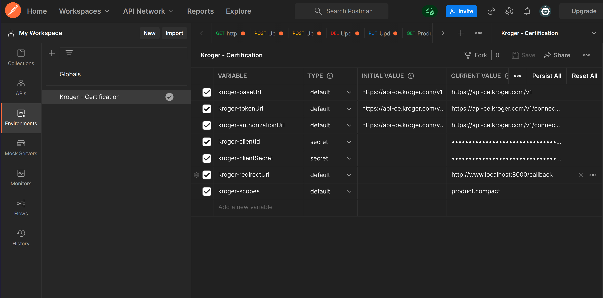
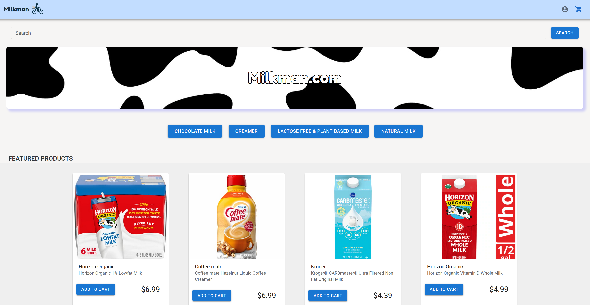
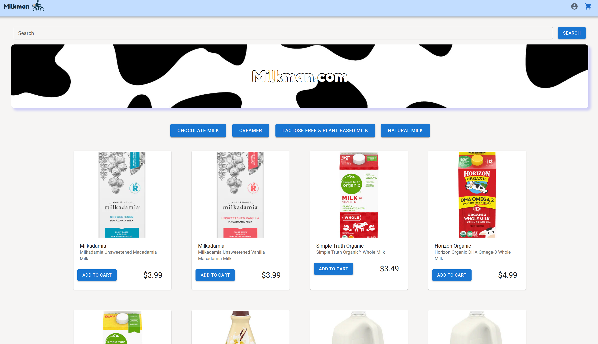
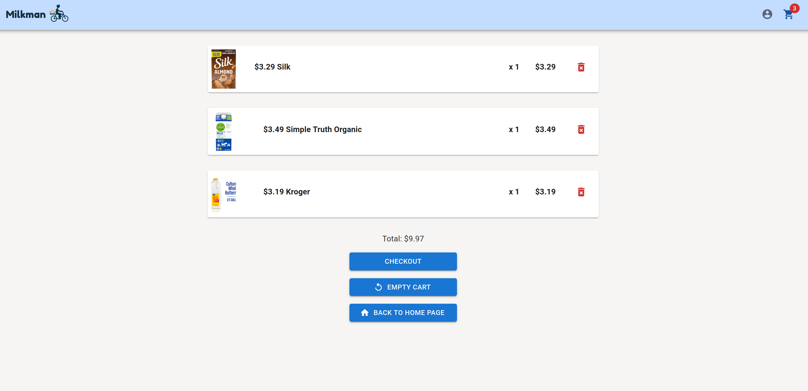
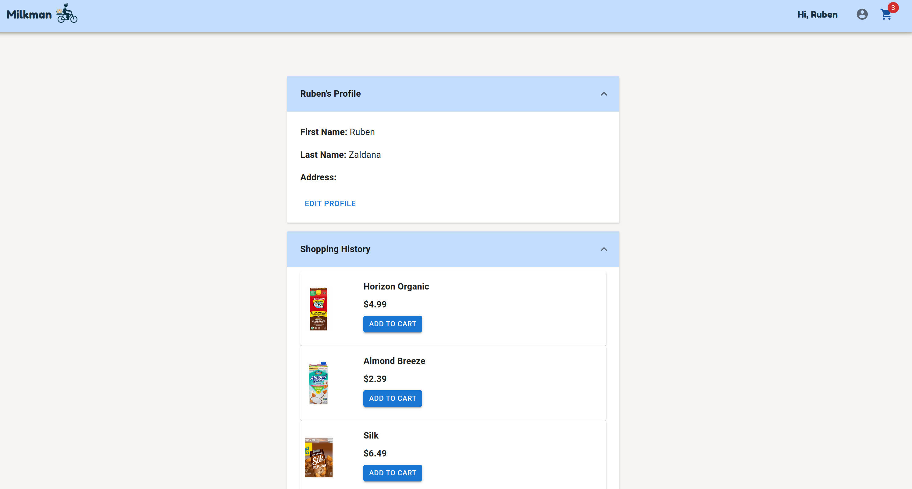
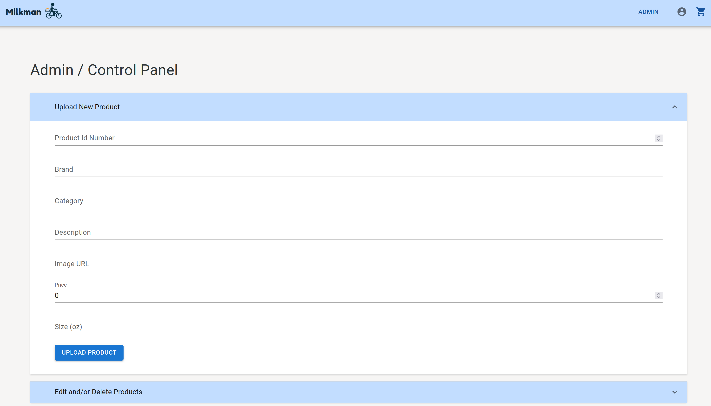
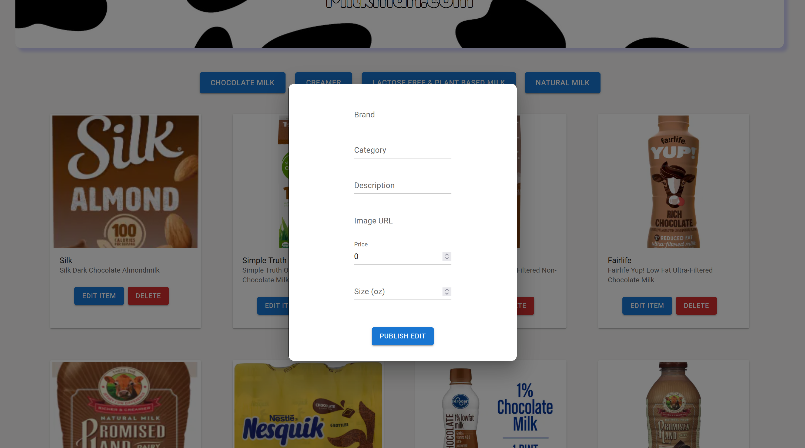

# **Milkman**

Milkman is an eCommerce site used to purchase milk and milk alternative products online.

# **Technology Stack**
 

 
 

## **Back-End**
Back-End Repo:
https://github.com/Zaldana/milkman-api/tree/main/src

**MongoDB + Node.js + Express**

The backend has two collections. The user collection that allows a user to create an account and login as well as capture 
shopping history. The second is the milk based product database.  
 

 
 
The product database was created using the Kroger Postman environment that calls Kroger's public API (available to download after registering for API access). After making a few queries to get the necessary products they were copied and stored into a mongoDB collection with Atlas. Before connecting to the backend, the products were filtered to remove any results that did not have the necessary elements (pictures, price, etc.). Using the Kroger Postman environment and Atlas made the building the products relatively simple. However, because I did not organize the schema it required me to drill down to get to the fields and/or results I needed for the front end.

## **Front-End**

The Frontend was created with React and Redux was used to manage the user state and the shopping cart state. MUI was used for the site styling.

 

 
 
The store is divided into four categories:
<li>Natural & Organic</li>
<li>Chocolate</li>
<li>Non Dairy</li>
<li>Creamer</li>

 

 
 

The site also has a cart where the customer can see a subtotal/total, remove objects, empty cart, or submit their order.

 

 
 

When a customer hits the checkout button the user state is updated by redux and the items, they have just purchased are added into their shopping history

 

 
 

Lastly if the user has an isAdmin Boolean set to true they see a modified version of the store. The admin users have the ability to add items to the database from the front-end, and edit/remove items from the product database.

 

 
 

# **Improvements**

The site needs an overall improvement to design and functionality. The product pictures are not all the same size. The description does not include sizes. The site also needs a detailed view of the products that utilizes more of the images that can be fetched from Kroger's API and nutrition facts. The cart needs to have more useful information like a detailed modal view when a product is clicked. The different sections of the page need more options to help the customer find a product faster, such as a filtering sidebar that narrows the results. The admin user needs the ability to manually update the featured products on the home page instead of a random selection on load.